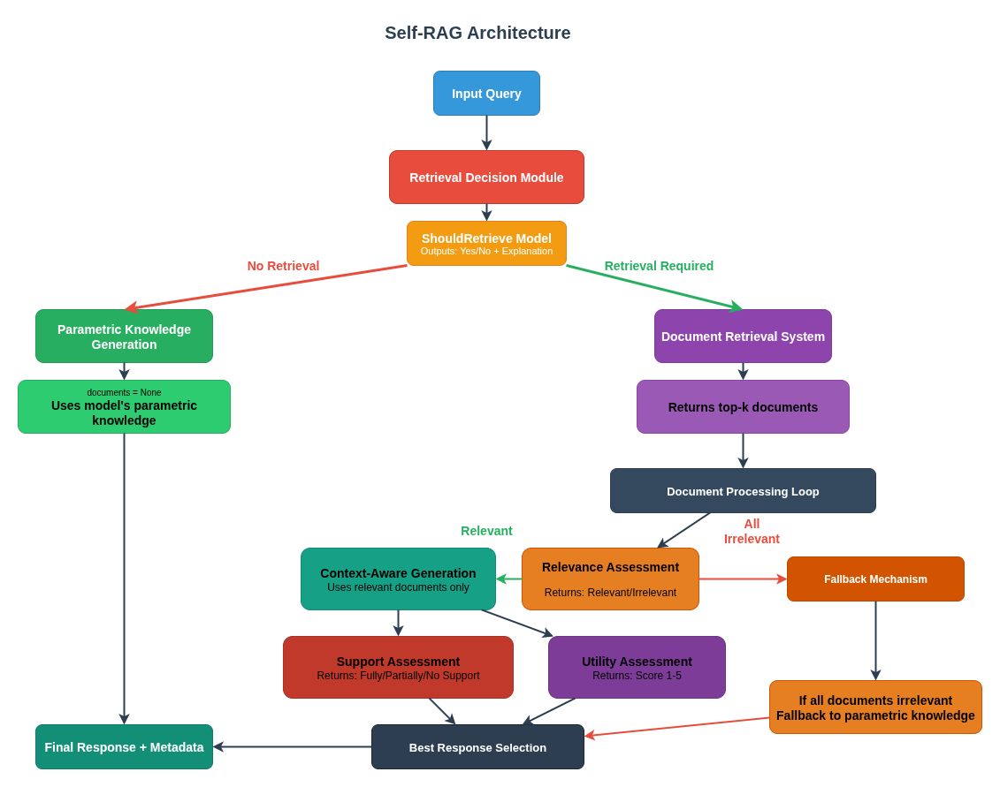

# Self-RAG: Self-Reflective Retrieval-Augmented Generation
Python implementation of Self-RAG based on the Paper - https://arxiv.org/pdf/2310.11511

## 🚀 Overview

Self-RAG addresses the limitations of traditional RAG systems by introducing **reflection tokens** that enable the model to:
- Decide when retrieval is actually needed
- Assess the relevance of retrieved documents
- Verify if generated responses are supported by evidence
- Evaluate the utility and helpfulness of responses

Unlike standard RAG systems that always retrieve documents regardless of necessity, Self-RAG makes intelligent decisions about when and how to use external knowledge.

## 🔬 How Self-RAG Works

### Traditional RAG Limitations

Standard RAG systems have a "one-size-fits-all" approach:
- **Always retrieve**: They fetch documents for every query, even when unnecessary
- **Fixed retrieval**: Always retrieve the same number of passages (e.g., top-5 documents)
- **No quality control**: No mechanism to verify if retrieved passages are relevant or if the generated response follows the evidence

### Self-RAG's Revolutionary Approach

Self-RAG introduces **reflection tokens** - special control tokens that enable the model to think about its own thinking process. These tokens are integrated into the model's vocabulary and generation process.

#### Types of Reflection Tokens

1. **Retrieval Tokens**
   - **Purpose**: Signal when external information is needed
   - **Example**: `[Retrieve]` or `[No Retrieval]`

2. **Critique Tokens**
   These evaluate different aspects of generation quality:

   **Relevance Assessment**:
   - `[Relevant]`: Retrieved passage is relevant to the query
   - `[Irrelevant]`: Retrieved passage doesn't help answer the query

   **Support Verification**:
   - `[Fully Supported]`: Generated response is completely backed by evidence
   - `[Partially Supported]`: Some parts are supported, others aren't
   - `[No Support]`: Response contradicts or lacks evidence support

   **Utility Assessment**:
   - `[Utility:5]`: Extremely helpful response
   - `[Utility:1]`: Not helpful at all

## 🏗️ Architecture

The Self-RAG system consists of several key components:

### 1. Retrieval Decision (`ShouldRetrieve`)
Determines whether external document retrieval is necessary or not .

### 2. Relevance Assessment (`RelevanceAssessment`)
Evaluates whether retrieved documents contain information relevant to the query

### 3. Support Assessment (`SupportAssessment`)
Verifies if the generated response is supported by the retrieved evidence.

### 4. Utility Assessment (`UtilityAssessment`)
Rates the helpfulness of the generated response on a scale of 1-5.
- **5**: Complete, highly detailed, fully addresses the query
- **4**: Mostly fulfills the need with minor improvements possible
- **3**: Acceptable but requires major additions to be complete
- **2**: Addresses main request but incomplete
- **1**: Barely on-topic or completely irrelevant

## 📦 Installation

1. Clone the repository:
```bash
git clone <repository-url>
cd self-rag
```

2. Install required dependencies:
```bash
pip install -r requirements.txt
```

3. Set up your OpenAI API key:
```bash
# Create a .env file in the project root
echo "OPENAI_API_KEY=your_openai_api_key_here" > .env
```


## 💻 Usage

### Basic Usage

```python
from self_rag import SelfRAGModel

# Initialize with URLs to index
urls = ["https://weaviate.io/blog/what-is-agentic-rag"]
model = SelfRAGModel(urls=urls)

# Generate response
response = model.generate("What are the core components of an AI agent mentioned in this blog?")
print(response['final_answer'])
```


### Output Format

The `generate()` method returns a dictionary with:

```python
{
    "final_answer": "The generated response",
    "used_retrieval": True,  # Whether retrieval was used
    "total_score": 6,       # Quality score (if retrieval was used)
}
```

## 🔄 How It Works

### Step-by-Step Process

1. **Query Analysis**: The system first decides if retrieval is needed for the given query
2. **Document Retrieval**: If needed, relevant documents are retrieved from the vector database
3. **Relevance Filtering**: Each retrieved document is assessed for relevance
4. **Response Generation**: Responses are generated using relevant documents
5. **Quality Assessment**: Each response is evaluated for support and utility
6. **Best Response Selection**: The highest-scoring response is selected as the final answer

### Decision Flow

```
Query → Should Retrieve? 
         ↓
    Yes → Retrieve Documents → Assess Relevance → Generate Response → Assess Support & Utility
         ↓
    No → Generate Direct Response → Assess Utility
```


## Architecture 

